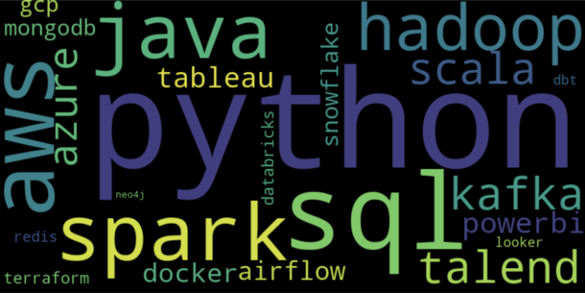
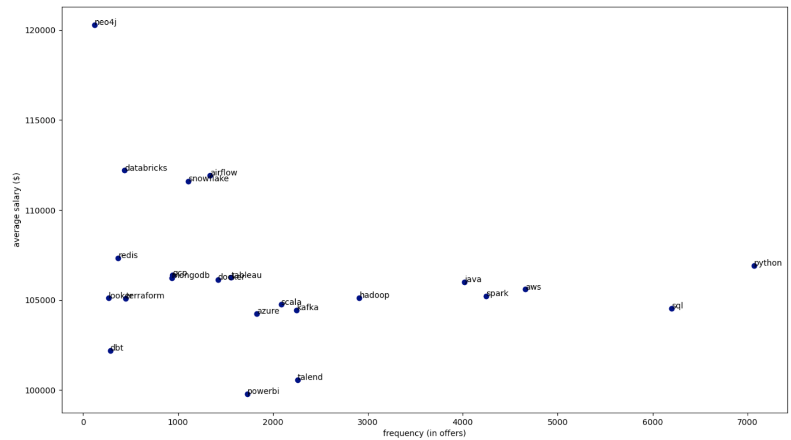

# Data engineering project: data engineering in the current job market

## Introduction
### Context
Data engineering being an emerging domain in the job market, it is undeniable that data practitioners are highly sought after. In the jungle of job offers, there should be a strategy to stay competitive on the job market: to be qualified for as many job offers as possible with an ideal level of salary. It is thus an interesting idea for us to carry out *a data engineering project on the data engineering market* with an emphasis on required tech stack in this field. This project is part of our project in the course *Foundation of data engineering* taught by Prof. Riccardo Tommasini at INSA Lyon .

### Objective
This project aims to construct a data pipeline which extracts, transforms and loads data engineering job data into a more structured type to serve further analysis. For the demo of the analysis, there are two basic questions implemented:
- What are the most demanded tech skills in the current data engineering job market?
- How is the popularity of these tech skills positioned with respect to the potential salary they can offer?

Additionally, a more advanced question can be further addressed in the next version of the project: what are the clusters of tech skills that usually form the so-called “tech stack”?

### Instruction

- Prerequisite: docker installed and open during the launch 
- To launch the project, run this command in the repo directory: docker-compose up
- Access to Airflow WebApp: http://localhost:8080
- Access to Jupyter Notebook: http://localhost:8888
- To explore the visualization of the final presentation layer or perform further analysis, open visualisation.ipynb in Jupyter Notebook

## Data source
There are two datasets used in this project:

### Kaggle
URL: https://www.kaggle.com/datasets/andrewmvd/data-engineer-jobs

Contains a tabular csv file describing data engineer job offers scraped from glassdoor

### Reddit
URL: https://www.reddit.com/r/dataengineering/comments/t4clep/quarterly_salary_discussion/

Contains discussions about current data engineer roles with additional information 

## Data Pipeline 
### Ingestion Zone
- **get_kaggle**: this node pulls the data from kaggle using the credentials stored in kaggle.json and saves it in a zip file (data-engineer-jobs.zip).
- **save_kaggle**: this node unzips the downloaded kaggle file, pre-processes it and saves it in the json format (kaggle_data.json).
- **get_reddit**: this node gets the data from reddit discussions using a specialized API called PRAW, pre-processes the data and also saves them as a json file (reddit.json).
- **ingest_mongodb**: this transition node ingests the aforementioned json data into mongodb using pymongo.
### Staging Zone
- **clean_all_data**: this node takes the data from mongodb and turns them into dataframes for better handling & cleaning using the Pandas library. Specifically, it performs extensive cleaning on the data and applies fuzzy string matching on the data to standardize the tech skill name in the dataset. The cleaned data are finally merged and saved in a common csv format (dataeng.csv).
> Attention: this node takes a lot of time (about 15-25 mins depending on the machine) since it performs a lot of fuzzy string matching between each standard tech skill in the list to the unstructured lengthy job descriptions. 

### Production Zone 
- **ingest_postgresql**: this node takes the cleansed csv file and ingest the data into the defined star-schema in postgresql. 

## Downstream usage - visualization
For this part, a word cloud of the most demanded tech skills is created to emphasize the importance of their appearance in the data engineering job market.  In addition, a scattered graph is plotted with one axis being the frequency of appearance of tech skills in data engineering and the other axis being the corresponding average salary for the job offers containing that tech skill. 

## Potential improvement & extension in the future
For advanced analysis, a graph database can be used to express the relationships between the tech skills to form a cluster of tech (“tech stack”),  with weighted relations according to their coherence.

